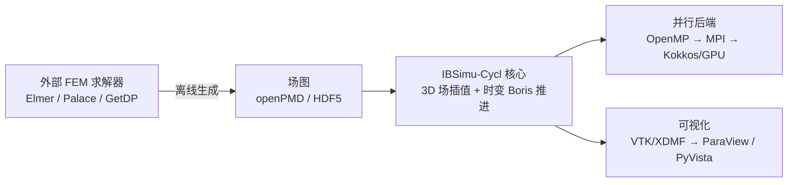
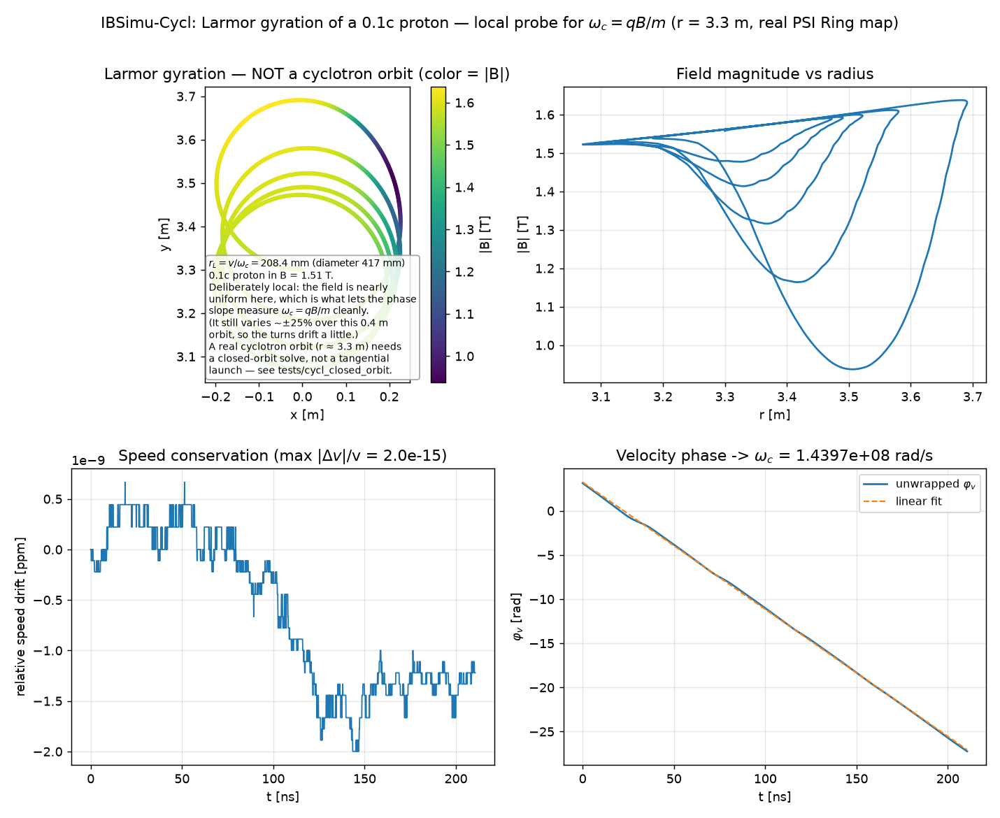
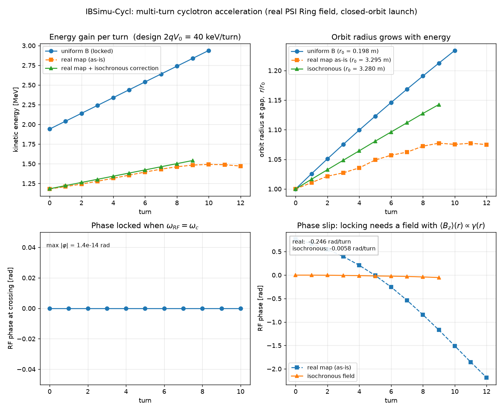
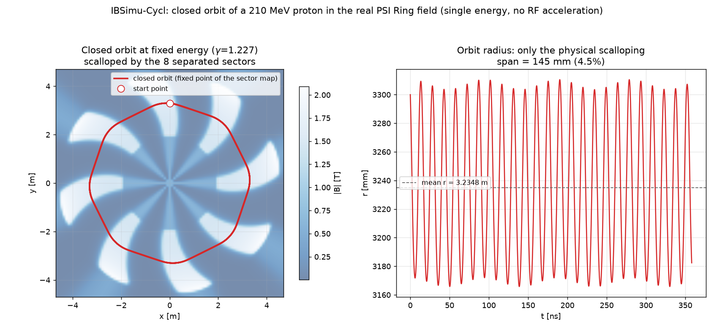
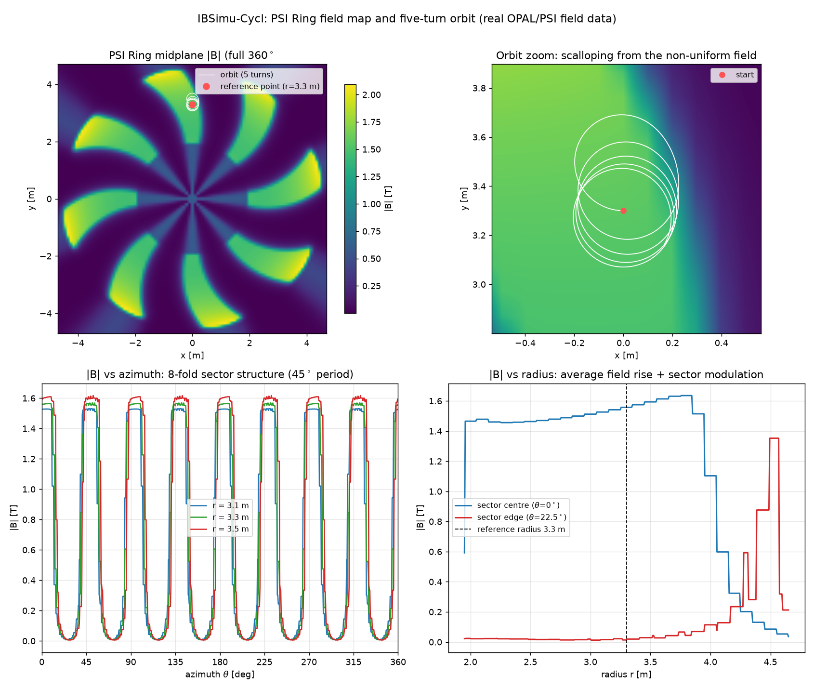

# IBSimu-Cycl

面向**回旋加速器（cyclotron）**的离子束/粒子仿真程序，基于开源项目
[IBSimu](https://ibsimu.sourceforge.net/)（Ion Beam Simulator）派生并扩展。

> 状态：**P0（项目初始化）** — 已导入上游 IBSimu 基线，正在搭建工程骨架与构建/CI。
> 详细规划见 [`docs/ROADMAP.md`](docs/ROADMAP.md)。

## 为什么要做这个项目

IBSimu 是一款成熟的离子源引出与低能束流输运仿真程序（2D/柱对称为主），
但它**原生面向轴对称问题**，难以直接用于回旋加速器：

1. **三维效率**：回旋加速器必须做三维场插值与粒子推进，需要并行化 / GPU 加速。
2. **物理能力缺口**：
   - 三维**磁铁磁场**（扇形磁铁，非轴对称）—— 上游仅有 `CAxisymmetricVectorField`；
   - **RF 谐振腔**的谐振频率与模式场计算；
   - 束流在**时变场**中的运动（相位滑动、能量增益）。
3. **可视化**：原生 GTK/cairo/OpenGL 的 3D 分析能力有限。

本项目在**保留 IBSimu 既有功能**（离子源引出、PIC/Vlasov 自洽迭代、DXF/STL 几何、
2D/柱对称求解器）的前提下，以模块化方式补齐上述能力。

## 总体思路

外部 FEM 求解器**只离线生成场图**，运行时 IBSimu-Cycl 只做**场插值 + 粒子推进**：



- **磁铁**：Elmer FEM（`WhitneyAV`，支持铁芯非线性饱和）
- **RF 腔**：Palace（MFEM 基，3D 电磁本征模，MPI + GPU）
- **加速**：Kokkos（一套代码覆盖 CPU/GPU）+ MPI（多节点）
- **可视化**：openPMD/HDF5 + VTK/XDMF，对接 ParaView / PyVista

## 目录结构

```
IBSimu-Cycl/
├─ src/                 # 上游 IBSimu 源码（扁平布局）+ 新增 3D 场/跟踪/求解模块
├─ tests/               # 上游单元测试 + 我们的物理校验算例
├─ doc/                 # 上游 Doxygen 文档
├─ docs/                # 本项目文档（路线图、架构、算例说明）
├─ adapters/            # 外部求解器适配器（magnet3d / rfcavity3d）
├─ python/ibsimu_cycl/  # Python 绑定与后处理
├─ examples/            # 回旋加速器算例与教程
└─ .github/workflows/   # CI
```

## 快速开始（构建上游基线）

依赖（Ubuntu/Debian）：

```bash
sudo apt-get install -y build-essential autoconf automake libtool pkg-config \
    zlib1g-dev libpng-dev libfontconfig1-dev libfreetype-dev libgtk-3-dev
```

默认构建（**包含 GTK GUI**）：

```bash
./reconf                 # 重新生成 configure（autotools）
./configure              # 默认启用 GTK GUI（系统存在 gtk+-3.0 时）
make -j"$(nproc)"
make check
```

无头构建（服务器 / CI）：

```bash
./configure --without-gtk3 --without-opengl
```

> 上游使用 GNU autotools。新增模块在 P0 阶段沿用该构建系统。

## 验证算例（来源）

我们采用 **OPAL-cycl 的标准回旋加速器算例**（PSI Ring，590 MeV，8 扇形区）作为
物理验证基准，包含真实三维磁场图与 RF 场图。详见
[`examples/cyclotron/README.md`](examples/cyclotron/README.md)。

## 端到端 Demo：真实磁场中的三维跟踪

`tests/cycl_track.cpp` 演示完整链路：读取真实 **PSI Ring** 磁场图（`bfield.dat`）
→ `CRingFieldMap3D` 三维场 → Boris 推动器积分质子运动 → 校验回旋频率 → 导出轨迹。

```bash
./reconf && ./configure && make -j"$(nproc)"
make -C tests cycl_track && ./tests/cycl_track        # 写出 cycl_track.csv / .vtk
python3 examples/cyclotron/plot_trajectory.py cycl_track.csv -o docs/img/cyclotron_orbit.png
```

结果（r = 3.3 m）：

| 量 | 数值 |
| --- | --- |
| 局部磁场 | `B = 1.5576 T` |
| 回旋频率（解析 `qB/m`） | `1.491981e8 rad/s` |
| 回旋频率（测量） | `1.492997e8 rad/s`（相对误差 **6.8e-4**） |
| 速率守恒（静磁场） | 相对漂移 `1.6e-15`（机器精度） |



轨迹同时输出 `cycl_track.vtk`（ParaView 可直接打开）与 `cycl_track.csv`。

## 多圈加速与相位滑移（P4）

`tests/cycl_accel.cpp` 用**局域 RF 间隙**（`CTimeVaryingField`）+ 磁场做多圈加速：

- **Part A（均匀场，可严格验证）**：两个**对径 dee 间隙**
  - 能量增益 `ΔE/turn = 2 q V0 cos φ`（测得 99.76 vs 100 keV，差 0.24% 渡越因子）
  - `ω_RF = ω_c` → **相位锁定**（`max|φ| < 1e-14 rad`）
  - `ω_RF = 0.98 ω_c` → **相位滑移 −0.12566 rad/圈**（与 `−2π·0.02` 精确一致）
  - 轨道半径按 `r = √(2KE/m)/ω_c` 外扩（`0.198 → 0.245 m`）
- **Part B（真实场图，整体缩放）**：测得回路周期、能量增益与相位演化（`−0.113 rad/圈`）



> **关于单间隙**：只有单个间隙时，切向冲量只会使**轨道中心漂移**而半径不增长；
> 必须用两个**对径**间隙（dee 的两侧）才能让中心漂移相互抵消、轨道同心外扩——
> 这与真实回旋加速器一致。
>
> ⚠️ 真实 PSI Ring 的绝对场强（~1.5 T）对应相对论速度（β≈0.6），超出当前**非相对论**
> Boris 推进器范围；Part B 因此采用**整体缩放**模型（保留 8 折扇形与径向结构）。
> 相对论推进器列入后续工作。

## 相对论推进器与真实场强下的 PSI Ring 轨道（F1）

`CBorisPusher` 现支持**相对论**模式（`set_relativistic(true)`，在 $u=\gamma v$ 空间做磁场旋转）。
`tests/cycl_relativistic.cpp` 验证：

| 校验项 | 结果 |
| --- | --- |
| 相对论回旋频率 $\omega_c=qB/(\gamma m)$ | 误差 `1.3e-5` |
| 静磁场中 $\gamma$ 守恒 | `3.7e-16`（机器精度） |
| 非相对论推进器（同速）对比 | $\omega$ 偏高 $\gamma$ 倍（ratio = 1.2000） |
| **真实 PSI Ring 场强**（$r=3.3$ m，$\langle B\rangle=0.669$ T） | $\gamma=1.224$，$\beta=0.577$，**KE = 210 MeV** |
| 轨道有界性与回路频率 | $r\in[2.94,3.56]$ m；$f_{rev}$ 与 $q\langle B\rangle/(2\pi\gamma m)$ 差 **2.0%** |



图中可见真实 PSI Ring 的 **8 折扇形结构**导致的轨道扇贝形起伏（$\gamma$ 保持恒定）。

> 这解除了 P4 的限制：**真实场强下的 PSI Ring 现在可以直接跟踪**，无需整体缩放。

## 步长选择：两条推进路径（R1-④）

`ParticleDataBase` **同时提供两条推进路径**，可按场景选择：

| 入口 | 步长 | 适用场景 |
| --- | --- | --- |
| `iterate_trajectories( scharge, efield, bfield )` | GSL **自适应**（`epsabs`/`epsrel`） | 一次性把轨道追到底；非 3D 网格（2D/CYL） |
| `step_particles( scharge, efield, bfield, dt )` | **Boris 固定 `dt`** | 固定时间栅格 / 与 RF 周期同步；时刻可控 |

两者都受 `set_relativistic(true)` 控制。`tests/cycl_stepper_modes.cpp` 以均匀 Bz 场中的
单粒子回旋运动（解析解）对两条路径做交叉验证（各 2 圈，固定步长取 `dt = T/1000`）：

| 路径 | 束流 | 轨道误差 | 速率漂移 | $\gamma$ |
| --- | --- | --- | --- | --- |
| 自适应 | 非相对论 | `4.4e-5` | `4.4e-5` | 1.000000 |
| 固定步长 | 非相对论 | `4.1e-5` | `4.9e-6` | 1.000000 |
| 自适应 | $\gamma=1.22$ | `6.4e-5` | `2.0e-5` | 1.220012 |
| 固定步长 | $\gamma=1.22$ | `6.2e-5` | `3.3e-6` | 1.220002 |

固定步长用法（`step_particles()` 每次调用推进一个 `dt`，并只沉积该步的电荷）：

```cpp
for( uint32_t n = 0; n < nsteps; n++ )
    pdb.step_particles( scharge, efield, bfield, dt );
```

> 上游的固定步长路径（`ParticleStepper`）**原本没有相对论分支**：
> `set_relativistic(true)` 对它无效，回旋频率会偏大 $\gamma$ 倍
> （$\gamma=1.22$ 时两圈后位置完全错位）。本项目已补齐 $u=\gamma v$ 空间的旋转
> （旋转向量含 $1/\gamma$ 因子），非相对论分支保持与原实现逐位一致。
>
> 已知限制：`step_particles()` 仅支持 3D 网格（2D/CYL 抛 `ErrorUnimplemented`），
> 且 `bfield` 目前为静态场。

## 并行化：OpenMP 粒子级并行（G1 / R1-①）

回旋加速器三维跟踪的天然并行维是**粒子维**（粒子间无相互作用，场为只读）。
`CEnsembleTracker` 用 OpenMP 并行推进整个系综：

- **只建立一个并行区、步间用屏障同步**，而不是每步一次 `parallel for`。
  后者在**场求值很快**（小场图/解析场，每粒子每步仅 ~0.1 μs）时会被
  fork/join 开销完全吃掉——N=2000 时实测反而只有 **0.61×（更慢）**。
- 时变场的相位更新放在 `single` 区，屏障保证同一步内所有粒子看到相同的 RF 相位。
- 结果与串行**逐位一致**（`max|diff| = 0.0`）。

强扩展性（i7-10750H，6 物理核 / 12 逻辑核，见 `tests/cycl_omp_tracker.cpp`）：

| 线程数 | 1 | 2 | 4 | 8 | 12 |
| --- | --- | --- | --- | --- | --- |
| 小场图（均匀场，N=20000 × 100 步） | 1.00× | 1.99× | 3.82× | 5.65× | **6.41×** |
| 真实 PSI Ring 场图（N=2000 × 400 步） | 1.00× | 2.01× | 3.91× | 5.91× | **6.76×** |

单线程速率 8.6×10⁶ 粒子·步/秒（真实场图，已含下述单核优化）。构建时若检测到 OpenMP
会自动启用（`configure.ac` 中的 `AC_OPENMP`）；可用 `OMP_NUM_THREADS` 限制线程数。

### 单核热路径优化（R1-②）

并行只是"用满核"，单核效率决定绝对性能。对真实场图的 profile 显示场求值有三个瓶颈，
均已修正：

- **网格索引重复计算**：原先每个场求值要调 6 次插值（每个分量一次），各算一遍
  (r,θ) 单元与权重 → 改为**只算一次、6 个分量共用**；
- **访存局部性**：6 个导数各存一个 1.2 MB 数组，一次插值的 4 个节点要跨越 6 段内存
  （≈12 条缓存行）→ 改为**按节点交错存储**（每节点 6 个 double 连续，≈4 条缓存行）；
- **超越函数**：`atan2`+`cos`+`sin` → `cos/sin` 由 `x/r`、`y/r` 直接得到，**省两次**。

| 指标（真实 PSI Ring，单线程） | 优化前 | 优化后 |
| --- | --- | --- |
| 跟踪耗时（N=2000 × 400 步） | 0.309 s | **0.093 s** |
| 吞吐 | 2.59×10⁶ 粒子·步/秒 | **8.63×10⁶ 粒子·步/秒** |

数值结果与优化前**逐位一致**（ω_c 相对误差 6.808e-4、γ 漂移 3.63e-16、KE=210.14 MeV）。
配合 OpenMP，相对原始实现的总加速约 **20–28×**。场求值基准见
`tests/cycl_fieldbench.cpp`（`make check` 会打印 Mevals/s）。

> 后续（R1-②）：MPI + hypre 区域分解（多节点）；GPU 端支持时变/射频场
> （当前 GPU 后端只处理静态磁场）。

### 空间电荷求解器的并行化（R1-②）

IBSimu 的空间电荷求解器（Gauss-Seidel / BiCGSTAB+ILU / **多重网格**）在上游
**全是串行**的。经实测选型（见 `docs/ROADMAP.md` §11.11）：

- **多重网格**优于 BiCGSTAB+ILU0：快 1.6–3.5×、省 6.5× 内存，且循环数与网格规模无关；
- 单节点 15 GB 内存下多重网格可支撑约 **710³** 网格，而 5 m 回旋加速器按 1 cm
  分辨率只需 500³ ≈ 97 s/次 → **无需 MPI**。

因此改为给多重网格加 OpenMP 并行。幸运的是它的平滑子本来就是**红黑
Gauss-Seidel**：同色遍历内 7 点模板只读相反颜色，因此可整体并行，且每个节点的
结果与串行**逐位相同**。已并行化 `rbgs_loop_3d`、`defect_3d`、`restrict_3d`、
`correct`（`prolong_3d` 是有冲突的散射加，保持串行）。

| 网格 | 1 线程 | 6 线程（物理核） | 加速 |
| --- | --- | --- | --- |
| 3D 129³ | 1.855 s | **0.501 s** | **3.7×** |
| 3D 257³ | 12.29 s | **4.51 s** | **2.7×** |
| 2D 1025² | 4.926 s | **1.585 s** | **3.1×** |
| CYL 513×257 | 0.291 s | **0.120 s** | **2.4×** |

解与迭代行为完全不变（`mgcyc`、`max|phi|` 与并行前一致）。2D/CYL 模式同样适用——
它们是 IBSimu 离子源与轴对称束流场景的主力，同样只改了并行指令、未改算法。
可用 `cycl_poisson_bench --2d <n>` / `--cyl <nz> <nr>` 复现。

> 提示：加速在物理核数处达到峰值，再多会因 SMT 争用而下降（模板计算受内存带宽
> 限制）。建议 `OMP_NUM_THREADS=` 物理核数。

### GPU 后端（R1-③，CUDA）

`CGpuEnsembleTracker` 把整个系综放到 GPU 上推进：场数据**一次性上传**显存（之后
每步不再传场），每个 GPU 线程跑完一个粒子的全部时间步（没有"每步启动 kernel"的
开销），粒子状态按 SoA 传输。

构建**不需要 nvcc**：内核源码以字符串内嵌，由 NVRTC 在运行期编译为 PTX，再用
CUDA Driver API 加载。

> 为什么不用 nvcc 编译 `.cu`？libtool 无法推断 nvcc 的配置，加 `--tag=CXX` 后会强制
> 注入 nvcc 不接受的裸 `-fPIC`；改用 `-Xcompiler -fPIC` 又会被重排到命令首部。
> NVRTC 方案完全不触自动 libtool，详见 `src/cyclotron/cuda/gpu_kernels.cu.h`。

`configure` 会自动探测 CUDA（`--with-cuda=DIR` / `--without-cuda`）。**未启用时
`available()` 返回 false、测试自动 `[SKIP]`**，因此无 GPU 的环境（含 CI）不受影响。

真实 PSI Ring 场图，N=100000 粒子 × 200 步：

| 后端 | 时间 | 吞吐 | 相对单线程 |
| --- | --- | --- | --- |
| CPU 单线程 | 2.30 s | 8.7 Mev/s | 1× |
| CPU 12 线程（OpenMP） | 0.32 s | 62 Mev/s | 7.1× |
| GPU（RTX 2060 Max-Q） | **0.073 s** | **275 Mev/s** | **31.6×** |

GPU 结果与 CPU 一致到机器精度（400 步后 `dx = 1.4e-14 m`、`dv/v = 3.8e-15`），
γ 逐粒子相对漂移 `2.0e-15`。该场景下 kernel 占 97%，数据传输仅 2.6%。

## 三维可视化与数据交换（R3）

新增**零外部依赖的 VTK XML 导出器**（`src/io/vtkwriter.cpp`），直接产出 ParaView /
PyVista 可打开的文件：

| 格式 | 内容 |
| --- | --- |
| `.vti` （ImageData） | 规则网格标量/矢量场（B、E、电势…） |
| `.vtp` （PolyData） | 粒子轨迹折线（每点带 `t` 标量，可按时间着色） |

```cpp
#include "vtkwriter.hpp"
using namespace ibsimu_cycl;

// 场图：标量 + 三分量矢量（数据按 i 最快排列，与 IBSimu 网格一致）
vtk_write_image_data( "field.vti", Int3D(nx,ny,nz), Vec3D(x0,y0,z0), Vec3D(h,h,h),
                      "Bmag", bmag, "B", bvec );
// 轨迹：一批折线
vtk_write_polylines( "orbit.vtp", lines );
```

查看方式：

```bash
paraview field.vti orbit.vtp                                    # 功能最全
python3 examples/cyclotron/view_3d.py field.vti orbit.vtp       # 交互（需 pyvista）
python3 examples/cyclotron/view_3d.py --save out.png orbit.vtp  # 批量出图
```

真实算例（PSI Ring 磁场图 + 五圈轨道）也会一并导出，可直接查看：

```bash
make -C tests cycl_track && (cd tests && ./cycl_track)
paraview tests/cycl_track_field.vti tests/cycl_track.vtp   # 轨道附近的三维 B + 轨道
paraview tests/cycl_track_map.vti                          # 整机中场图（中平面 360°）
python3 examples/cyclotron/plot_field_map.py               # 直接出 PNG
```



上图由 `examples/cyclotron/plot_field_map.py` 生成：整机中场 $|B|$（可见 **8 折扇形结构**）、
轨道区域放大（可见非均匀场导致的扇贝形起伏）、$|B|$ 沿方位角（45° 周期）与沿半径的分布。
轨道与场图均由 `tests/cycl_track` 从真实 `bfield.dat` 重建，
参考点 $r=3.3$ m、$\theta=90^\circ$ 处 $|B| = 1.557581$ T（与解析判据逐位一致）。

Python 侧另有一套**独立实现**的读取器 `python/ibsimu_cycl/vtk_io.py`：不装 VTK
也能做后处理，同时充当导出器的交叉验证。

```python
from ibsimu_cycl.vtk_io import read
fd = read("field.vti"); grid = fd.scalar_grid("Bmag")   # (nz, ny, nx)
tr = read("orbit.vtp"); tr.points.shape, len(tr.lines)
```

验证：`tests/cycl_vtk_export.cpp`（导出 → 逐值回读校验 + 真实轨道端到端）与
`python/tests/test_vtk_io.py`（**不同语言、不同实现**的交叉校验，CI 两个构建作业均运行）。

> 大规模数据（>1e8 点）的二进制/追加段后端（HDF5/openPMD、`.pvti`）见 ROADMAP R3-③。

### 顺带修正的一个精度问题

端到端验证暴露出 `CBorisPusher` 的 **Boris 启动瞬态**：标准 leapfrog/Boris 的速度
定义在半步上，直接用 $t=0$ 的速度起步会让回旋半径产生 $\omega\Delta t\,r/2$ 的振荡
（实测振幅 `4.8839e-4`，理论 `4.8840e-4`，符合到 4 位有效数字）。
新增 `CBorisPusher::initialize()`（半步反踢，对应上游 `ParticleStepper::initialize()`）
后振幅降到 `3.8359e-6`，**抑制 127×**。

## 文档

| 文档 | 内容 |
| --- | --- |
| [`docs/ROADMAP.md`](docs/ROADMAP.md) | 规划、里程碑与逐阶段进展记录（含全部实测数据） |
| [`docs/UPSTREAM_ARCHITECTURE.md`](docs/UPSTREAM_ARCHITECTURE.md) | **上游 IBSimu 架构总结**：模块地图、数据流、关键约定、并行现状 |
| [`docs/WORK_LOG.md`](docs/WORK_LOG.md) | **工作日志 / 交接文档**：时间线、关键决策理由、踩坑清单、当前状态与下一步 |
| [`docs/DEVELOPMENT.md`](docs/DEVELOPMENT.md) | 构建与开发说明 |
| [`CONTRIBUTING.md`](CONTRIBUTING.md) | 贡献指南 |
| [`THIRD_PARTY_NOTICES.md`](THIRD_PARTY_NOTICES.md) | 第三方组件许可 |

## 许可证

本项目为 IBSimu 的派生作品，整体以 **GNU GPL v3.0-or-later** 发布。
上游 IBSimu 版权归 Taneli Kalvas 及 The Regents of the University of California /
Lawrence Berkeley National Laboratory 所有，以 **GPL-2.0-or-later** 授权，见原
[`COPYING`](COPYING)。第三方组件的许可与兼容性见
[`THIRD_PARTY_NOTICES.md`](THIRD_PARTY_NOTICES.md)。

## 上游与致谢

- IBSimu: <https://ibsimu.sourceforge.net/>（`git clone https://git.code.sf.net/p/ibsimu/code`）
- 基线提交：`09beedb`（2026-07-29，分支 `master`）
- OPAL / OPALX: <https://github.com/OPALX-project>
