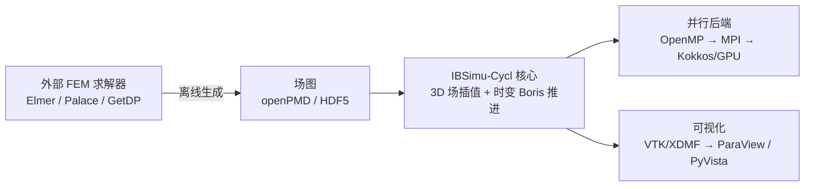

# IBSimu-Cycl

面向**回旋加速器（cyclotron）**的离子束/粒子仿真程序，基于开源项目
[IBSimu](https://ibsimu.sourceforge.net/)（Ion Beam Simulator）派生并扩展。

> 状态：**P0（项目初始化）** — 已导入上游 IBSimu 基线，正在搭建工程骨架与构建/CI。
> 详细规划见 [`docs/ROADMAP.md`](docs/ROADMAP.md)。

## 为什么要做这个项目

IBSimu 是一款成熟的离子源引出与低能束流输运仿真程序（2D/柱对称为主），
但它**原生面向轴对称问题**，难以直接用于回旋加速器：

1. **三维效率**：回旋加速器必须做三维场插值与粒子推进，需要并行化 / GPU 加速。
2. **物理能力缺口**：
   - 三维**磁铁磁场**（扇形磁铁，非轴对称）—— 上游仅有 `CAxisymmetricVectorField`；
   - **RF 谐振腔**的谐振频率与模式场计算；
   - 束流在**时变场**中的运动（相位滑动、能量增益）。
3. **可视化**：原生 GTK/cairo/OpenGL 的 3D 分析能力有限。

本项目在**保留 IBSimu 既有功能**（离子源引出、PIC/Vlasov 自洽迭代、DXF/STL 几何、
2D/柱对称求解器）的前提下，以模块化方式补齐上述能力。

## 总体思路

外部 FEM 求解器**只离线生成场图**，运行时 IBSimu-Cycl 只做**场插值 + 粒子推进**：



- **磁铁**：Elmer FEM（`WhitneyAV`，支持铁芯非线性饱和）
- **RF 腔**：Palace（MFEM 基，3D 电磁本征模，MPI + GPU）
- **加速**：Kokkos（一套代码覆盖 CPU/GPU）+ MPI（多节点）
- **可视化**：openPMD/HDF5 + VTK/XDMF，对接 ParaView / PyVista

## 目录结构

```
IBSimu-Cycl/
├─ src/                 # 上游 IBSimu 源码（扁平布局）+ 新增 3D 场/跟踪/求解模块
├─ tests/               # 上游单元测试 + 我们的物理校验算例
├─ doc/                 # 上游 Doxygen 文档
├─ docs/                # 本项目文档（路线图、架构、算例说明）
├─ adapters/            # 外部求解器适配器（magnet3d / rfcavity3d）
├─ python/ibsimu_cycl/  # Python 绑定与后处理
├─ examples/            # 回旋加速器算例与教程
└─ .github/workflows/   # CI
```

## 快速开始（构建上游基线）

依赖（Ubuntu/Debian）：

```bash
sudo apt-get install -y build-essential autoconf automake libtool pkg-config \
    zlib1g-dev libpng-dev libfontconfig1-dev libfreetype-dev libgtk-3-dev
```

默认构建（**包含 GTK GUI**）：

```bash
./reconf                 # 重新生成 configure（autotools）
./configure              # 默认启用 GTK GUI（系统存在 gtk+-3.0 时）
make -j"$(nproc)"
make check
```

无头构建（服务器 / CI）：

```bash
./configure --without-gtk3 --without-opengl
```

> 上游使用 GNU autotools。新增模块在 P0 阶段沿用该构建系统。

## 验证算例（来源）

我们采用 **OPAL-cycl 的标准回旋加速器算例**（PSI Ring，590 MeV，8 扇形区）作为
物理验证基准，包含真实三维磁场图与 RF 场图。详见
[`examples/cyclotron/README.md`](examples/cyclotron/README.md)。

## 许可证

本项目为 IBSimu 的派生作品，整体以 **GNU GPL v3.0-or-later** 发布。
上游 IBSimu 版权归 Taneli Kalvas 及 The Regents of the University of California /
Lawrence Berkeley National Laboratory 所有，以 **GPL-2.0-or-later** 授权，见原
[`COPYING`](COPYING)。第三方组件的许可与兼容性见
[`THIRD_PARTY_NOTICES.md`](THIRD_PARTY_NOTICES.md)。

## 上游与致谢

- IBSimu: <https://ibsimu.sourceforge.net/>（`git clone https://git.code.sf.net/p/ibsimu/code`）
- 基线提交：`09beedb`（2026-07-29，分支 `master`）
- OPAL / OPALX: <https://github.com/OPALX-project>
